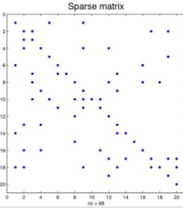
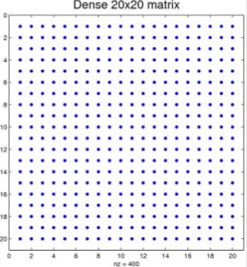

#  Clustering & PCA Lab

## Introduction

> ***Note:*** _This can be a pair programming activity or done independently._

This week, we've looked at a variety of unsupervised learning methods from a variety of clustering methods to PCA. For this lab, we're going to pull together your clustering and PCA knowledge, combined with some text processing that you learned in previous weeks, to create a full data science pipeline.

Here's the case: 

You're working for a research agency that's trying to understand the patterns behind news articles. Your task is to first collect the raw news article data, utilize CountVectorizer to tokenize the data, perform a component analysis, and cluster the data.

#### Truncated Singular Value Decomposition ####

For this lab, instead of using PCA as we've done in previous weeks, we're going to take a look at **Truncated Singular Value Composition**, or SVD. The SVD algorithm works very similarly to the PCA algorithm, however it works directly with the sample vectors as opposed to the covariance matrix. This is useful in our case since when using ```CountVectorizer```, the function returns a *sparse matrix*



...whereas PCA requires a dense matrix. 



## Exercise

#### Requirements

- Collect the data
- Perform a **truncated singular value decomposition (SVD)** on the dataset to determine which components are most significant within the articles.
- Create a write-up of your findings; for the technical team members make sure to comment your process, and for the non-technical team members, draft a brief report to outline why your findings are significant.

Just as in a real life scenario, the data and your analysis will not always be clear cut. While you may be wondering when you've succeeded in solving the problem, we're looking for your best recommendations based on the available data. Work through the process until you and your teammate have enough information to provide an in-depth analysis. Your manager would like to see at least 60% accuracy for your analysis.

**Bonus:**

1. Continue tuning your model to reach a higher threshold/percentage
2. Triangulate or repeat using a different method

#### Starter code

For this project, we're going to be utilizing the Newsgroup 20 data that is publicly available on the UCI Machine learning repository. Fortunately, Scikit has a direct implementation of this to make our data collection process easy:

```
from sklearn.datasets import fetch_20newsgroups
newsgroups_train = fetch_20newsgroups(subset='train')
```

We're going to be looking at the training subset, which included several thousand news articles, as a subset of the larger 20,000 newsgroup article set. 

Within this set, we can have two attributes - the data and the class labels. 

Our class labels are under "target_names" 

```
newsgroups_train.target_names
```

and our data:

```
newsgroups_train.data
```

[Here is your starter code!](./code/starter-code.ipynb)

#### Deliverable ####

Your finished product will be a Jupyter Notebook containing your analysis, which will include;

- Your solution code
- A brief write-up on your findings, with one paragraph on your findings and one paragraph on your procedures
- Recommendations for further analytical procedures on the datasets


## Additional Resources

- A link to [the Newsgroup 20 datasets](http://scikit-learn.org/stable/datasets/twenty_newsgroups.html) for Scikit. 
- The [SVD Documentation](http://scikit-learn.org/stable/modules/generated/sklearn.decomposition.TruncatedSVD.html)for Scikit. 
